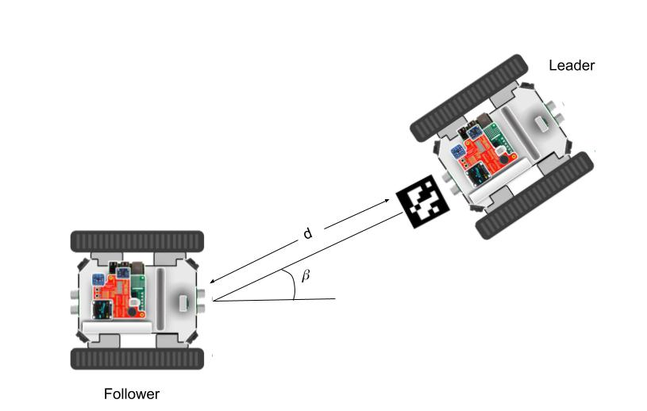

---
header-includes:
  - \usepackage{algorithm2e}
---

Design and Implementation {#implementation}
===========================================

Use case description
------------------------------------
In this research project we develop a  use case for rover-apps. 
For the use case we are using two _Rovers_, a **Rover Leader** and a **Rover Follower**. 
Hereinafter, we will only use **Leader** or **Follower** to refer to them. 
The leader has a visual marker, the follower should detect it, estimate the angle $\beta$ and distance $d$ with respect to the leader as is shown in figure \ref{img:roverusecase}, and follow the leader. 

This chapter will be focused on the development of the behavior of the follower because is the only rover that must be completely autonomous. 
The  following sections will describe requirements, main hardware parts involved and software tools required to implement follower's behavior, camera calibration and pose estimation theory, and software implementation details. 

Requirements
-------------------
**Still have no idea how to write them**
- The system is the follower, but it doesn't actually matter right now. 

- Functional requirements? 
    - The follower should detect a visual marker.
    - The follower should estimate the distance and angle to the marker.
    - The follower should steer based on the estimated values.
    - The follower should be completely autonomous. 

- Software requirements? 
    - The follower should run Raspbian  as operating system.
    - The follower code should use OpenCV library.
    - The follower code should be based on rover-app libraries. 
    - The follower code should be mantainable.
    - The follower code should be reusable.
    - The follower code should be easy to read and understand.

Hardware and Software 
----------------------
As it was mentioned in the introduction, the rover vehicle is based on a raspberry pi 3 that can run _Raspbian Jessie_ or _AGL_ as Operating system.
For this use case the follower runs a  _Raspbian Jessie_ image.
The available hardware

Camera calibration and the pinhole model
-------------------------------------------

If you hold that box in front of you in a dimly lit room, with the pinhole facing some light source  you see an inverted image appearing on the translucent plat [@Forsyth2002]. 
In figure \ref{img:pinholemodel}, a 3D object (pyramid) is projected first on a scene plane, and then on the image plane. 
Each point in the scene plane or _world frame_  will have it's correspondence in the image plane or _camera frame_. 
The distance from the pinhole to the image plane is called focal lenght.  

![The pinhole imaging model [@Garcia2001]. \label{img:pinholemodel}](img/pinholemodel-complete.png)

Camera calibration is a necessary step in 3D computer vision in order to extract metric information from 2D images [@Zhang2004]. 
The mathematical model of a pinhole camera can be devired using linear algebra and the visual representation  shown in figure \ref{img:pinholemodel}. 
<!--
 (I may add in the appendix the derivation of the equations)
--> 

Let's denote a 2D point $\mathbf{\hat{m}} = [x,y,1]^{T}$,  a 3D point $\mathbf{\hat{M}} = [X,Y,Z,1]^{T}$, there exists a camera projection matrix $\mathbf{P}$ such that $\mathbf{\hat{m}} = \mathbf{P}\mathbf{\hat{M}}$. 

\begin{equation}
\mathbf{\hat{m}} = \mathbf{P}\mathbf{\hat{M}} = \mathbf{A}\lbrack \mathbf{R} \quad \mathbf{t} \rbrack \mathbf{\hat{M}}
\label{eq:projection}
\end{equation}

The camera intrinsic matrix $\mathbf{A}$ contains information about the internal parameters of the camera: focal lenght, image sensor format and principal point or image center. 
The coordinates of the principal point is described by  $(x_0, y_0)$, $\alpha_{x}$ and $\alpha_{y}$ represent the focal lenght in terms of pixels on the axis $x$ and $y$, and $\gamma$ is the skew of image.

\begin{equation}
\mathbf{A} = \begin{bmatrix}
\alpha_{x} & \gamma & x_{0} \\
0 & \alpha_{y} & y_{0} \\
0 & 0 & 1 \end{bmatrix} 
\label{eq:intrinsicparameters}
\end{equation}

The camera extrinsic parameters are given by the rotation matrix $\mathbf{R}$ and translation vector $\mathbf{t}$. which are used to project an image on the world frame to camera frame.
There is also a scale transformation, but it's already given by $\alpha_{x}$ and $\alpha_{y}$.

Current cameras are equipped with lenses that produce some distortions on the images, however, the pinhole model is still a good aproximation for our case since we are using a **PiCamera** which has minimal distortions. 

The camera calibration has been done with using `OpenCV`. 
This library implementation is based on the technique described by [@Zhang2000] and the matlab implementation done by [@Bouguet2010]. 
The calibration technique in [@Zhang2000] requires the camera to observed a planar pattern, usually a chessboard pattern, at different orientations, the more the better the estimation of the intrinsic parameters. 
The calibration algorithm minimize the reprojection error which is the distance between observed feature points on the planer pattern and the projected using the estimates parameters. 
 
For calibration we used a _ChArUco_ board instead of the clasical chessboard because it generates a better estimation of the pamateres [@opencv_library]. 

![Plannar Patterns [@opencv_library] \label{img:pattern}](img/pattern.png)

The procedure to calibrate the PiCamera is straightforward with `OpenCV` and the sample codes found under `opencv_contrib-3.4.1/modules/aruco/samples`. 
**A detailed explantion can be found in the Appendix (not sure but is a remainder)**. 

1. Create a charuco board, print it and paste it on a solid and planar surface.
2. Compile the example code `calibrate_camera_charuco.cpp` and run it
3. Place your pattern in different orientations and take pictures 
4. When you are done, just close the program 

**ADD PICTURE OF THE PATTERN ON MY OFFICE**

In our case, the camera intrinsic matrix $\mathbf{A}$ is as following:

\begin{equation}
\mathbf{A} = 
\begin{bmatrix}
\alpha_{x} & \gamma & x_{0} \\
0 & \alpha_{y} & y_{0} \\
0 & 0 & 1 
\end{bmatrix}=
 \begin{bmatrix}
6.125e+02 & 0. &  3.216e+02 \\
0 & 6.122e+02 & 2.365e+02 \\
0 & 0 & 1 
\end{bmatrix} 
\label{eq:resultintrinsicparameters}
\end{equation}

<!--
A more detailed description should be added in the appendix
-->

Extrinsic Parameters
--------------------------
As it was mention before, the camera extrinsic parameters are given by the rotation matrix $\mathbf{R}$ and translation vector $\mathbf{t}$. 
A rotation matrix can be formed as the product of three rotations around three cardinal axes, e.g., $x$, $y$, and $z$, or $x$, $y$, and $x$. This is generally a bad idea, as the result depends on the order in which the transforms applies [@Szeliski2010].

However, a rotation can be also represented by a rotation axis $\mathbf{k} = \lbrack k_{x},k_{y},k_{z} \rbrack ^{T}$ and an angle $\theta$, or equivalenly by a vector $\mathbf{\omega} = \theta\mathbf{k}$. 
In order to do the transformation from axis-angle representation to rotation matrix,  the cross-product matrix $\mathbf{K}$ and Rodrigues' rotation formula  can be used. 

\begin{equation}
\mathbf {K} =
\begin{bmatrix}
0       & -k_{z}    &  k_{y} \\
k_{z}   & 0         & -k_{x} \\ 
-k_{y}  &k_{x}      & 0
\end{bmatrix}
\label{eq:crossproductmatrix}
\end{equation}

\begin{equation}
\mathbf {R} =\mathbf {I} +(\sin \theta )\mathbf {K} +(1-\cos \theta )\mathbf{K} ^{2}
\label{eq:rodrigues}
\end{equation}

<!--
Should I add the mathematical formulation for rodrigues formula? or just put it on the appendix
-->

Rotation matrix to Euler angles
------------------------------------

In order to get the angles related a rotation whose yaw, pitch and roll angles are $\phi$, $\rho$ and $\psi$. These angles are rotations in $z$, $y$ and $x$ axis respectively.
We will rotate first about the $x$-axis, then the $y$-axis, and finally the $z$-axis.  Such a sequence of rotations can be represented as the matrix product

\begin{equation}
\mathbf{R}=R_{z}(\phi )\,R_{y}(\rho )\,R_{x}(\psi ) 
\end{equation}

\begin{equation}
R_{x}(\psi) = 
\begin{bmatrix}
 1 & 0 & 0 \\ 0 & \cos \psi & -\sin \psi \\ 0 & \sin \psi & \cos \psi  
\end{bmatrix}
\end{equation}

\begin{equation}
R_{y}(\rho )  =
\begin{bmatrix}
\cos \rho & 0& \sin \rho \\ 0& 1& 0\\ -\sin \rho & 0& \cos \rho 
\end{bmatrix}
\end{equation}

\begin{equation}
R_{z}(\phi )  =
\begin{bmatrix}
\cos \phi & -\sin \phi & 0\\ \sin \phi & \cos \phi & 0\\ 0& 0& 1
\end{bmatrix}
\end{equation}

Given the given sequence of rotations and the algorithm described by [@Slabaugh1999], the angles can be found using  algorithm 1.

\begin{figure}[ht]
 \centering
\begin{minipage}{.4\linewidth}
\begin{algorithm}[H]
\DontPrintSemicolon
\SetAlgoLined
\BlankLine
\eIf{ $R_{31} \neq \pm 1$}{
    $ \phi = \arctan2 (R_{21}, R_{11}) $\;
    $ \rho = -\arcsin (R_{31}) $\;
    $ \psi = \arctan2 (R_{32}, R_{33}) $\;
}{
    $ \phi = 0$ \;
    $ \rho = -R_{31}\pi/2$ \;
    $ \psi = \arctan2 (-R_{23}, R_{22} )$ \;
}
\caption{Slabaugh's algorithm}
\end{algorithm} 
\end{minipage}
\end{figure}

Use case implementation details
-------------------------------
As it was mention before the follower should be completely autonomous. 
In order to do so, the follower will need to read data from sensors, process that data and create movement based on the results of the processing. 

In figure \ref{img:roverusecase} is shown a diagram of our use case. 
The main sensor is a PiCamera, the processing part performs the marker detection the calculation of the euler angles and distance based on the equations described in the last section, and finally  the movement is generated using the driving rover services.

**Image Processing with OpenCV**  
aueouaeotnuaehountsheotnuh aeuaoeuaetnos eaouhaoenthu. 
atoenuhanoethunthsaotnhuaoeunhaoeu. 
aeouhaoensthu

**Relevant information**   
It's only important to check only rotation in Y-Axis because the rover-vehicle is just a car. 

**GY-521: Gyroscope Reading**  
The CY-521 sensor is an accelerometer and gyroscope, with that information we could estimate the angular position of follower. 
However, since the follower has none magnetometer the information given by the accelerometer is useless, since we have no information about the _magnetic north_. 

uaeohuaoetnshutns etnahutnaeho uoeantsuhaoetnhun.
etauhnsaetoh

