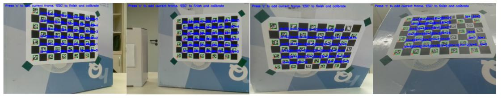
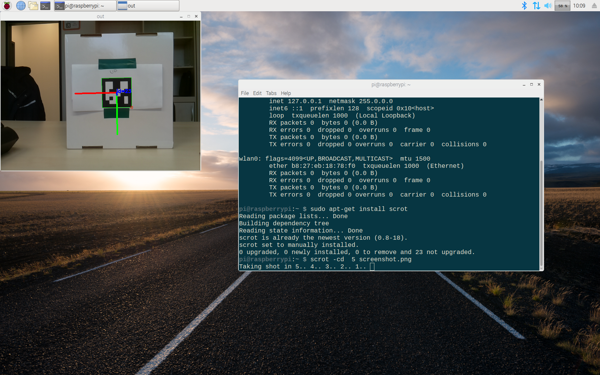
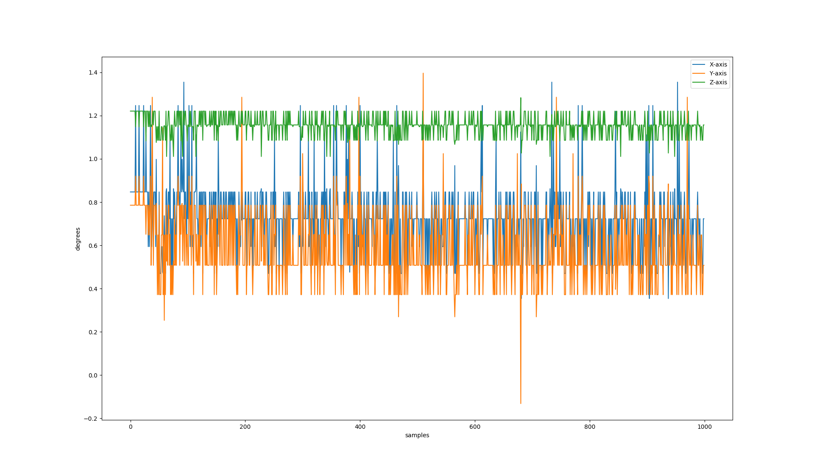
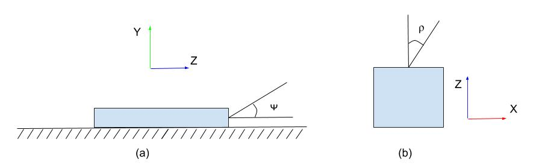
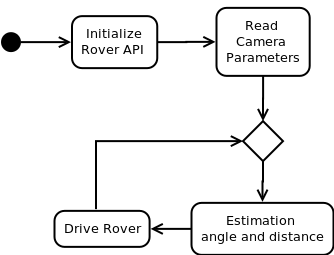

---
header-includes:
  - \usepackage{algorithm2e}
---

Design and Implementation {#implementation}
===========================================

Use case description
------------------------------------
In this research project we develop a  use case for rover-apps. 
For the use case we are using two _Rovers_, a **Rover Leader** and a **Rover Follower**. 
Hereinafter, we will only use **Leader** or **Follower** to refer to them. 
The leader has a visual marker, the follower should detect it, estimate the angle $\beta$ and distance $d$ with respect to the leader as is shown in figure \ref{img:roverusecase}, and follow the leader. 


This chapter will be focused on the development of the behavior of the follower because is the only rover that must be completely autonomous. 
The  following sections will describe requirements, main hardware parts involved and software tools required to implement follower's behavior, camera calibration and pose estimation theory, and software implementation details. 


Requirements
-------------------
**Still have no idea how to write them**
- The system is the follower, but it doesn't actually matter right now. 


- Functional requirements? 
    - The follower should detect a visual marker.
    - The follower should estimate the distance and angle to the marker.
    - The follower should steer based on the estimated values.
    - The follower should be completely autonomous. 

- Software requirements? 
    - The follower should run Raspbian  as operating system.
    - The follower code should use OpenCV library.
    - The follower code should be based on rover-app libraries. 
    - The follower code should be mantainable.
    - The follower code should be reusable.
    - The follower code should be easy to read and understand.


Camera calibration and the pinhole model
-------------------------------------------
Camera calibration is a necessary step in 3D computer vision in order to extract metric information from 2D images [@Zhang2004]. 
If you hold that box in front of you in a dimly lit room, with the pinhole facing some light source  you see an inverted image appearing on the translucent plat [@Forsyth2002]. 
In figure \ref{img:pinholemodel}, a 3D object (pyramid) is projected first on a scene plane, and then on the image plane. 
Each point in the scene plane or _world frame_  will have it's correspondence in the image plane or _camera frame_. 
The distance from the pinhole to the image plane is called focal lenght.  


![The pinhole imaging model [@Garcia2001]. \label{img:pinholemodel}](img/pinholemodel-complete.png)

The mathematical model of a pinhole camera can be devired using linear algebra and the visual representation  shown in figure \ref{img:pinholemodel}. 
<!--
 (I may add in the appendix the derivation of the equations)
--> 

Let's denote a 2D point $\mathbf{\hat{m}} = [x,y,1]^{T}$,  a 3D point $\mathbf{\hat{M}} = [X,Y,Z,1]^{T}$, there exists a camera projection matrix $\mathbf{P}$ such that $\mathbf{\hat{m}} = \mathbf{P}\mathbf{\hat{M}}$. 

\begin{equation}
\mathbf{\hat{m}} = \mathbf{P}\mathbf{\hat{M}} = \mathbf{A}\lbrack \mathbf{R} \quad \mathbf{t} \rbrack \mathbf{\hat{M}}
\label{eq:projection}
\end{equation}

The camera intrinsic matrix $\mathbf{A}$ contains information about the internal parameters of the camera: focal lenght, image sensor format and principal point or image center. 
The coordinates of the principal point is described by  $(x_0, y_0)$, $\alpha_{x}$ and $\alpha_{y}$ represent the focal lenght in terms of pixels on the axis $x$ and $y$, and $\gamma$ is the skew of image.


\begin{equation}
\mathbf{A} = \begin{bmatrix}
\alpha_{x} & \gamma & x_{0} \\
0 & \alpha_{y} & y_{0} \\
0 & 0 & 1 \end{bmatrix} 
\label{eq:intrinsicparameters}
\end{equation}


The camera extrinsic parameters are given by the rotation matrix $\mathbf{R}$ and translation vector $\mathbf{t}$. which are used to project an image on the world frame to camera frame.
There is also a scale transformation, but it's already given by $\alpha_{x}$ and $\alpha_{y}$.

Current cameras are equipped with lenses that produce some distortions on the images, however, the pinhole model is still a good aproximation for our case since we are using a **PiCamera** which has minimal distortions. 

The camera calibration has been done with using `OpenCV`. 
This library implementation is based on the technique described by [@Zhang2000] and the matlab implementation done by [@Bouguet2010]. 
The calibration technique in [@Zhang2000] requires the camera to observed a planar pattern, usually a chessboard pattern, at different orientations, the more the better the estimation of the intrinsic parameters. 
The calibration algorithm minimize the reprojection error which is the distance between observed feature points on the planer pattern and the projected using the estimates parameters. 
 
For calibration we used a _ChArUco_ board instead of the clasical chessboard because it generates a better estimation of the pamateres [@opencv_library]. 

![Plannar Patterns [@opencv_library] \label{img:pattern}](img/pattern.png)


The procedure to calibrate the PiCamera is straightforward with `OpenCV` and the sample codes found under `opencv_contrib-3.4.1/modules/aruco/samples`. 
**A detailed explantion can be found in the Appendix (not sure but is a remainder)**. 

1. Create a charuco board, print it and paste it on a solid and planar surface.
2. Compile the example code `calibrate_camera_charuco.cpp` and run it
3. Place your pattern in different orientations and take pictures 
4. When you are done, just close the program 





In our case, the camera intrinsic matrix $\mathbf{A}$ is as following:


\begin{equation}
\mathbf{A} = 
\begin{bmatrix}
\alpha_{x} & \gamma & x_{0} \\
0 & \alpha_{y} & y_{0} \\
0 & 0 & 1 
\end{bmatrix}=
 \begin{bmatrix}
6.125e+02 & 0. &  3.216e+02 \\
0 & 6.122e+02 & 2.365e+02 \\
0 & 0 & 1 
\end{bmatrix} 
\label{eq:resultintrinsicparameters}
\end{equation}


<!--
A more detailed description should be added in the appendix
-->

Extrinsic Parameters
--------------------------
As it was mention before, the camera extrinsic parameters are given by the rotation matrix $\mathbf{R}$ and translation vector $\mathbf{t}$. 
A rotation matrix can be formed as the product of three rotations around three cardinal axes, e.g., $x$, $y$, and $z$, or $x$, $y$, and $x$. This is generally a bad idea, as the result depends on the order in which the transforms applies [@Szeliski2010].

However, a rotation can be also represented by a rotation axis $\mathbf{k} = \lbrack k_{x},k_{y},k_{z} \rbrack ^{T}$ and an angle $\theta$, or equivalenly by a vector $\mathbf{\omega} = \theta\mathbf{k}$. 
In order to do the transformation from axis-angle representation to rotation matrix,  the cross-product matrix $\mathbf{K}$ and Rodrigues' rotation formula  can be used. 


\begin{equation}
\mathbf {K} =
\begin{bmatrix}
0       & -k_{z}    &  k_{y} \\
k_{z}   & 0         & -k_{x} \\ 
-k_{y}  &k_{x}      & 0
\end{bmatrix}
\label{eq:crossproductmatrix}
\end{equation}

\begin{equation}
\mathbf {R} =\mathbf {I} +(\sin \theta )\mathbf {K} +(1-\cos \theta )\mathbf{K} ^{2}
\label{eq:rodrigues}
\end{equation}

<!--
Should I add the mathematical formulation for rodrigues formula? or just put it on the appendix
-->


Rotation matrix to Euler angles
------------------------------------

In order to get the angles related a rotation whose yaw, pitch and roll angles are $\phi$, $\rho$ and $\psi$. These angles are rotations in $z$, $y$ and $x$ axis respectively.
We will rotate first about the $x$-axis, then the $y$-axis, and finally the $z$-axis.  Such a sequence of rotations can be represented as the matrix product

\begin{equation}
\mathbf{R}=R_{z}(\phi )\,R_{y}(\rho )\,R_{x}(\psi ) 
\end{equation}


\begin{equation}
R_{x}(\psi) = 
\begin{bmatrix}
 1 & 0 & 0 \\ 0 & \cos \psi & -\sin \psi \\ 0 & \sin \psi & \cos \psi  
\end{bmatrix}
\end{equation}


\begin{equation}
R_{y}(\rho )  =
\begin{bmatrix}
\cos \rho & 0& \sin \rho \\ 0& 1& 0\\ -\sin \rho & 0& \cos \rho 
\end{bmatrix}
\end{equation}


\begin{equation}
R_{z}(\phi )  =
\begin{bmatrix}
\cos \phi & -\sin \phi & 0\\ \sin \phi & \cos \phi & 0\\ 0& 0& 1
\end{bmatrix}
\end{equation}


Given the given sequence of rotations and the algorithm described by [@Slabaugh1999], the angles can be found using  algorithm 1.

\begin{figure}[ht]
 \centering
\begin{minipage}{.4\linewidth}
\begin{algorithm}[H]
\DontPrintSemicolon
\SetAlgoLined
\BlankLine
\eIf{ $R_{31} \neq \pm 1$}{
    $ \phi = \arctan2 (R_{21}, R_{11}) $\;
    $ \rho = -\arcsin (R_{31}) $\;
    $ \psi = \arctan2 (R_{32}, R_{33}) $\;
}{
    $ \phi = 0$ \;
    $ \rho = -R_{31}\pi/2$ \;
    $ \psi = \arctan2 (-R_{23}, R_{22} )$ \;
}
\caption{Slabaugh's algorithm}
\end{algorithm} 
\end{minipage}
\end{figure}


Use case implementation details
-------------------------------
As it was mentioned before, the follower should be completely autonomous. 
In order to do so, the follower will need to read data from sensors, process that data and generate movement based on the processed data. 

In figure \ref{img:roverusecase} is shown a diagram of our use case. 
The main sensor is a PiCamera, the processing part performs the marker detection on the captured frames and the calculation of the euler angles and distance based on the equations described in the last section, and finally  the movement is generated using the driving rover services.

&nbsp;


**Video Processing with OpenCV**  
Just like in the case of camera calibration, we use `OpenCV` and the submodule `aruco`  to capture video and process the frames in order to extract information from the visual markers.
To estimate and detect the marker at the beginning  we should load the camera intrinsic parameters, saved in a YAML file,  and the Aruco dictionary, composed by 250 markers and a marker size of 6x6 bits [@opencv_library],  to memory.


&nbsp;


```c++
// cameraMatrix: camera intrinsic parameters 
// dictionary: aruco dictionary
cv::FileStorage fs("calibration.yml", cv::FileStorage::READ);
fs["camera_matrix"] >> cameraMatrix;
cv::Ptr<cv::aruco::Dictionary> dictionary = 
     cv::aruco::getPredefinedDictionary(cv::aruco::DICT_6X6_250);
```

&nbsp;


Given a video frame, it is possible to detect Aruco markers if they are visible.
When the marker is detected, we extract the four corners  of the marker using `cv::aruco::detectMarkers` function.
The first corner is the top left corner, followed by the top right, bottom right and bottom left. 
The next step is to estimate the extrinsic camera parameters, which means the rotation vector $\omega$ and the translation vector $\mathbf{t}$. 
The size of the marker is an input parameter of the `OpenCV` function `cv::aruco::estimatePoseSingleMarkers`. In our case the marker size is 7cm. 


&nbsp;


```c
// image: input frame 
// corners: detected corners
// rvect: rotation vector
// tvect: translation vector
cv::aruco::detectMarkers(image, dictionary, corners, ids);
cv::aruco::estimatePoseSingleMarkers( corners, 0.07, 
                                cameraMatrix, 0, rvec, tvec);
```

&nbsp;


The next step is calculating the Euler angles by using function `cv::Rodrigues`  and  Slabaugh's algorithm. 
The `cv:Rodrigues` function is a direct implementation of equations \ref{eq:crossproductmatrix} and \ref{eq:rodrigues}. 

&nbsp;


```c++
// rmat: rotation matrix
// angle: Euler angles
cv::Rodrigues(rvec.row, rmat);
rotationMatrixToEulerAngles(rmat, angle)
```


&nbsp;

An example is  shown in figure  \ref{img:cameraaxis}, the euler angles are $\psi = 165$, $\rho = 25$ and $\psi = 0$. The green, red and blue axes correspond to the X-axis, Y-axis and Z-axis respectively.
As expected from the pin hole model, $\psi$ is near 180 because the image is facing the camera as result the blue axis points towards the camera.




A basic code for video processing the marker  is as follows:

```c
// Initialization 
cv::VideoCapture inputVideo(0);
cv::FileStorage fs("calibration.yml", cv::FileStorage::READ);
fs["camera_matrix"] >> cameraMatrix;
fs["distortion_coefficients"] >> distCoeffs;

inputVideo.open(0);
cv::Ptr<cv::aruco::Dictionary> dictionary = 
    cv::aruco::getPredefinedDictionary(cv::aruco::DICT_6X6_250);
...

// Video processing  
inputVideo.read(image);
cv::aruco::detectMarkers(
    image, dictionary, corners, ids);
cv::aruco::estimatePoseSingleMarkers(
    corners, 0.07, cameraMatrix, 
    distCoeffs, rvec, tvec);
cv::Rodrigues(rvec, rmat);
rotationMatrixToEulerAngles(rmat, angles);
```


However, the estimated angles can not be used directly because estimations have small errors.
In figure \ref{img:axisplot} can be observed the values of the rotation angles in a span of 1000 samples and in table 2.1 the stadistics of those samples.
The ground truth values for euler angles were $\lbrack 0, 0, 0\rbrack$, and for distance were 47.5 and 16  centimeters respectively. 

Data          Mean        $\sigma$    Median  
----------   ------------ ---------- -------------
$\psi$ deg    0.719853     0.162262    0.723000  
$\rho$ deg    0.584508     0.165382    0.507618  
$\phi$ deg    1.155499     0.046940    1.157000   
$d$ cm        45.51706     0.033564    45.50772  
$d$ cm        15.65339     0.007401    15.65401

Table: Stadistics of estimated euler angles and distance to visual marker


The results of standard deviation $\sigma$  from table 2.1 suggest the estimated values can be stable ($\sigma < 0.16$ deg) overall, particularly in the case of distance to the marker ($\sigma < 0.04cm$)
However, figure \ref{img:axisplot} suggests the existence of pike values, thus we must filter the samples in order to minimize the effect of those outliers. 
A median filter is highly effective removing outliers from data, but requires to save chunks of datain memory, but because the results showed that the mean and the median of euler angles are similar, thus it is reasonable to think that outliers has small influence on the data.
In other words, the mean filter is a simple and effective option againts outliers problem. Its implementation is straighforward and requires no memory to save previous values. 
A pseudocode is as follows:

```c
estAngle = 0;
for( i=0; i<samples; i++)
    estAngle += new_value;       
estAngle /= samples; 
``` 




&nbsp;


**Rover rotations**   
Rover is a  ground vehicle which means that only steer in one axis. 
Thus, only rotations in Y-Axis are possible. 
Aas shown in figure \ref{img:roverrotations} rotations in X-axis are not possible since the rover can not fly or go underground.  The same applies to rotations in Z-axis.
In other words, the only relevant information from the estimated euler angles is $\rho$, or the angle related the Y-axis.



&nbsp;


**Measuring angular displacement**  
In order to move the follower to a defined angular position, the CY-521 board is used.
The CY-521 has an accelerometer and a gyroscope.
The accelerometer works by measuring the components of gravity in the diferrent axis, taking the "earth" or gravity acceleration as reference.
On the other hand, the gyroscope measures angular speed relative to itself or own rotation, using the inertial force called the Coriolis effect.

With that information we could estimate the angular position of follower.
However, the values from the accelerometer are not taking into account because the gravity vector is parallel to the Y-axis.
It is important to note that we want to measure relative rotations, thus in the inital position the angle will always be $0$.


The gyroscope measures angular speed in all axis, in particular the angular speed in  Y-axis or  $\omega_{y}$.
The angular displacement $\rho$ is just the integral of $\omega_{y}$. 

\begin{equation}
\rho = \int \omega_{y}(t) dt 
\end{equation}


\begin{equation}
\omega_{y} = \frac{\delta \rho}{\delta t}
\end{equation}

Nonetheless, the calculation is done in a computer, thus we use the _Forward Euler Method_ to solve the integral.

\begin{equation}
\rho \lbrack n+1\rbrack= \rho \lbrack n \rbrack + \Delta t \omega_{y} \lbrack n \rbrack
\end{equation}


where $\Delta t$ is the sampling period between sensor readings and $\rho \lbrack 0 \rbrack = 0$. A pseudocode of the rotation routine is as follows:


&nbsp;


```c
current_angle = 0;

// clockwise rotation 
if( desired_angle <=0 ) turnRight();
// counterclockwise rotation
else turnLeft();

while( abs(current_angle - desired_angle) > 0)
        wait(sampling_period);
        current_angle += getAngle()*sampling_period;

stop();
```


&nbsp;


**Implementation**  
The activity diagram of use case is shown in figure  \ref{img:activitydiagram}.
First, the rover API is initialized, it also includes the motor and sensors, and the camera intrinsic parameters are load into memory as described before. 

&nbsp;

```c
RoverBase r_base; /* Rover API */ 
RoverDriving r_driving;  /* Rover driving service */
RoverGY521 r_accel; /* gyro and accelerometer */
/* Ultrasonic sensors */ 
RoverHCSR04 r_front = RoverHCSR04(ROVER_FRONT);
RoverHCSR04 r_rear  = RoverHCSR04(ROVER_REAR); 
```

&nbsp;





After the inital set up, a infinity loop starts.
During the loop we estimate the angle $\rho$ and distance $d$, the later is the norm of the translation vector $d = \left\lVert \mathbf{t} \right\rVert_{2}$.
The motion is done in two steps: rotation and translation. 
The follower rotates $\rho$ degrees and when it is done, it goes forward $d$ centimeters. 
The current distance is measured using the front ultrasonic ranging module HC-SC04.
The rover-API can only give accuarate information for distances lower than 40 cm [@roverAPI], for distances greater than 40cm the API returns always 40cm.
However, that's not a problem because the follower is already rotate when the forward movement starts. 
Thus, when the follower approaches the leader eventually will be in the measurable range. 

Once the follower reaches the leader, it stops and wait until the leader moves again.
A pseudocode of the loop is as follows:

&nbsp;


```c
while(1){
    // Initialization of the current values
    estimated_angle = 0;
    estimated_distance = 0;

    // Mean filter
    for(i=0; i<nSamples; i++){
        readFrame();
        [rvec, tvec] = getExtrinsicParameters();
        estimated_angle += getYrotation(rvec);
        }
    estimated_angle /= nSamples;
    estimated_distance = norm(tvec); 

    // Driving routines
    rotateNdegrees(estimated_angle);
    moveForwoard(estimated_distance);
}
```


