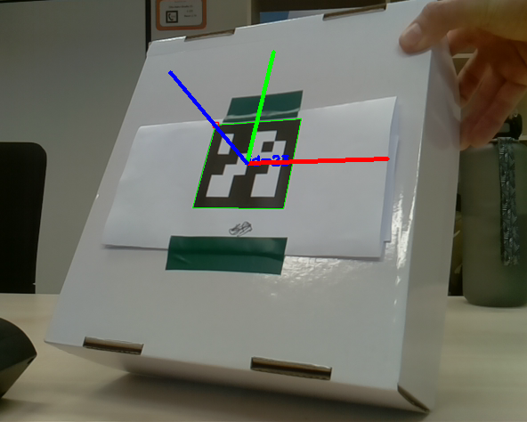

---
header-includes:
  - \usepackage{algorithm2e}
---

Design and Implementation {#implementation}
===========================================

In this research project we develop an example of a  rover-app. 
For the use case of our application  we are using two _Rovers roles_, a **Rover Leader**, and a **Rover Follower** running our rover-app. 
Hereinafter, we will only use **Leader** or **Follower** to refer to them. 
The Leader has a visual marker, the Follower should detect it, estimate the angle $\beta$ and distance $d$ with respect to the Leader as is shown in Figure \ref{img:roverusecase}, and follow the Leader without any human intervention.  


This chapter will focus on the design and development of our rover-app. 
In addition, we present the theoretical background required to understand design decisions.
The  following sections will describe the main requirements, camera calibration, pinhole model and pose estimation theory, and implementation details. 


Requirements
-------------------
The main requirements for the rover Follower are listed in Table 2.1. 


--------------------------------------------------------------------
Requirement         Description  
--------------      ----------------------------------------------------
01.Detect visual       The Follower should detect the predefined  
marker              visual marker, created by the ArUco library [@opencv_library],  
                    using the PiCamera mounted on it.

02.Estimation          The Follower should estimate the angle and distance 
angle and           to the marker every time the Leader moves to another 
distance            position. 

03.Follower            The Follower should steer based on the estimated 
driving             angle and distance.

04.Autonomous          The Follower should be completely autonomous. 
driving             Detection of the marker and driving should be done
                    with no human intervention other than turning the
                    rover on and initial positioning.  

05.Operating           The Follower should run Raspbian Jessie  as 
system              operation system. 

06.OpenCV              The Follower should use OpenCV 3.4.1 [@opencv_library] for the video
library             processing including reading video frames, marker
                    detection, and estimation of the angle and distance
                    to the marker. 

07.Rover-App           The Follower's code should be based on the services such
library             as sensor reading and driving provided by the 
                    rover-app library. 

08.Maintainability      The Follower's code should be maintainable following 
                    principles of modularity and encapsulation, and 
                    avoiding code duplication code. 

09.Reusable            The Follower's code should be reusable. Subroutines
                    or functions should be well defined, and its 
                    design should take into account orthogonality 
                    and extensibility. 

10.Understandability   The Follower's code should be understandable. Comments
                    should be relevant, variable and function names
                    should be self explanatory, the code sections should
                    be well defined (includes, global/static/volatile
                    variables declarations, function definitions, 
                    main function).

--------------------------------------------------------------------

Table: Most importante requirements


Camera calibration and the pinhole model
-------------------------------------------
Camera calibration is a necessary step in 3D computer vision in order to extract metric information from 2D images [@Zhang2004]. 
The calibration process is based on the pinhole camera model shown in Figure \ref{img:pinholemodel}.
A 3D object (pyramid) is projected first on a scene plane, and then on the image plane. 
Each point in the scene plane or _world frame_  has its correspondence in the image plane or _camera frame_. 
The distance from the pinhole to the image plane is called focal length.  


![The pinhole imaging model [@Garcia2001]. \label{img:pinholemodel}](img/pinholemodel-complete.png)

The mathematical model of a pinhole camera can be derived using linear algebra and the visual representation  shown in Figure \ref{img:pinholemodel}. 
<!--
 (I may add in the appendix the derivation of the equations)
--> 

Let's denote a 2D point $\mathbf{\hat{m}} = [x,y,1]^{T}$,  a 3D point $\mathbf{\hat{M}} = [X,Y,Z,1]^{T}$, there exists a camera projection matrix $\mathbf{P}$ such that $\mathbf{\hat{m}} = \mathbf{P}\mathbf{\hat{M}}$.  The camera projection matrix can be decomponsed in two matrices $\mathbf{A}$ and $\lbrack \mathbf{R} \quad \mathbf{t} \rbrack$. 

\begin{equation}
\mathbf{\hat{m}} = \mathbf{P}\mathbf{\hat{M}} = \mathbf{A}\lbrack \mathbf{R} \quad \mathbf{t} \rbrack \mathbf{\hat{M}}
\label{eq:projection}
\end{equation}

The camera intrinsic matrix $\mathbf{A}$ contains information about the internal parameters of the camera: focal length, image sensor format and principal point or image center. 
This matrix is the output of the calibration process. 
The coordinates of the principal point is described by  $(x_0, y_0)$, $\alpha_{x}$ and $\alpha_{y}$ represent the focal length in terms of pixels on the axis $x$ and $y$, and $\gamma$ is the skew of the image.


\begin{equation}
\mathbf{A} = \begin{bmatrix}
\alpha_{x} & \gamma & x_{0} \\
0 & \alpha_{y} & y_{0} \\
0 & 0 & 1 \end{bmatrix} 
\label{eq:intrinsicparameters}
\end{equation}


The camera extrinsic matrix are given by the rotation matrix $\mathbf{R}$ and translation vector $\mathbf{t}$ which are used to project an image on the world frame to camera frame. 
Moreover, the scale transformation is given by $\alpha_{x}$ and $\alpha_{y}$.
In the following section we will describe how to extract relevant information such as the rotation angles. 


The camera calibration is performed using `OpenCV`. 
This library implementation is based on the technique described by [@Zhang2000] and the matlaparameters parameters b implementation done by [@Bouguet2010]. 
parameters The calibration technique in [@Zhang2000] requires the camera to observe a planar pattern, usually a chessboard pattern, at different orientations. The more samples, the better the estimation of the intrinsic parameters. 
The calibration algorithm minimizes the reprojection error, which is the distance between observed feature points on the planer pattern and the projected using the estimated parameters. 
 
For calibration, we used a _ChArUco_ board instead of the classical chessboard because it generates a better estimation of the parameters [@opencv_library]. 

![Planar Patterns [@opencv_library] \label{img:pattern}](img/pattern.png)


The procedure to calibrate the PiCamera is straightforward with `OpenCV` and the sample codes found under `opencv_contrib-3.4.1/modules/aruco/samples`. 
The following list is necessary in order to perform a calibration process:

1. Create a charuco board, print it and paste it on a solid and planar surface.
2. Compile the example code `calibrate_camera_charuco.cpp` and run it
3. Place your pattern in different orientations and take pictures 
4. When you are done, just close the program 


In our case, the camera intrinsic matrix $\mathbf{A}$ is as following:


\begin{equation}
\mathbf{A} = 
\begin{bmatrix}
\alpha_{x} & \gamma & x_{0} \\
0 & \alpha_{y} & y_{0} \\
0 & 0 & 1 
\end{bmatrix}=
 \begin{bmatrix}
6.125e+02 & 0. &  3.216e+02 \\
0 & 6.122e+02 & 2.365e+02 \\
0 & 0 & 1 
\end{bmatrix} 
\label{eq:resultintrinsicparameters}
\end{equation}


<!--
A more detailed description should be added in the appendix
-->

Rotation matrix to Euler angles
------------------------------------
As mentioned before, the camera extrinsic parameters are given by the rotation matrix $\mathbf{R}$ and translation vector $\mathbf{t}$. 
A rotation matrix can be formed as the product of three rotations around three cardinal axes, e.g., $x$, $y$, and $z$, or $x$, $y$, and $x$. This is generally a bad idea, as the result depends on the order in which the transforms applies [@Szeliski2010].

However, a rotation can be also represented by a rotation axis $\mathbf{k} = \lbrack k_{x},k_{y},k_{z} \rbrack ^{T}$ and an angle $\theta$, or equivalently by a vector $\mathbf{\omega} = \theta\mathbf{k}$. 
In order to do the transformation from axis-angle representation to rotation matrix,  the cross-product matrix $\mathbf{K}$ and Rodrigues' rotation formula  can be used. 


\begin{equation}
\mathbf {K} =
\begin{bmatrix}
0       & -k_{z}    &  k_{y} \\
k_{z}   & 0         & -k_{x} \\ 
-k_{y}  &k_{x}      & 0
\end{bmatrix}
\label{eq:crossproductmatrix}
\end{equation}

\begin{equation}
\mathbf {R} =\mathbf {I} +(\sin \theta )\mathbf {K} +(1-\cos \theta )\mathbf{K} ^{2}
\label{eq:rodrigues}
\end{equation}

<!--
Should I add the mathematical formulation for rodrigues formula? or just put it on the appendix
-->


In order to get the angles related a rotation whose yaw, pitch and roll angles are $\phi$, $\rho$ and $\psi$. These angles are rotations in $z$, $y$ and $x$ axis respectively.
We will rotate first about the $x$-axis, then the $y$-axis, and finally the $z$-axis.  Such a sequence of rotations can be represented as the matrix product

\begin{equation}
\mathbf{R}=R_{z}(\phi )\,R_{y}(\rho )\,R_{x}(\psi ) 
\end{equation}


\begin{equation}
R_{x}(\psi) = 
\begin{bmatrix}
 1 & 0 & 0 \\ 0 & \cos \psi & -\sin \psi \\ 0 & \sin \psi & \cos \psi  
\end{bmatrix}
\end{equation}


\begin{equation}
R_{y}(\rho )  =
\begin{bmatrix}
\cos \rho & 0& \sin \rho \\ 0& 1& 0\\ -\sin \rho & 0& \cos \rho 
\end{bmatrix}
\end{equation}


\begin{equation}
R_{z}(\phi )  =
\begin{bmatrix}
\cos \phi & -\sin \phi & 0\\ \sin \phi & \cos \phi & 0\\ 0& 0& 1
\end{bmatrix}
\end{equation}


Following the sequence of rotations presented above and the algorithm described by [@Slabaugh1999], the angles can be found using  algorithm 1.

\begin{figure}[ht]
 \centering
\begin{minipage}{.4\linewidth}
\begin{algorithm}[H]
\DontPrintSemicolon
\SetAlgoLined
\BlankLine
\eIf{ $R_{31} \neq \pm 1$}{
    $ \phi = \arctan2 (R_{21}, R_{11}) $\;
    $ \rho = -\arcsin (R_{31}) $\;
    $ \psi = \arctan2 (R_{32}, R_{33}) $\;
}{
    $ \phi = 0$ \;
    $ \rho = -R_{31}\pi/2$ \;
    $ \psi = \arctan2 (-R_{23}, R_{22} )$ \;
}
\caption{Slabaugh's algorithm}
\end{algorithm} 
\end{minipage}
\end{figure}


Implementation details
-------------------------------
According to Requirement 04, the Follower should be completely autonomous. 
In order to do so, the Follower captures video frames, processes the frames with `OpenCV` a and generate movement based on the processed data. 


&nbsp;


**Video Processing with OpenCV**  
We use `OpenCV` and the submodule `aruco`  to capture video and process the frames in order to extract information from the visual markers (Requirement 01, 02).
To estimate and detect the marker at the beginning  we should load the camera intrinsic parameters, saved in a YAML file,  and the Aruco dictionary, composed by 250 markers and a marker size of 6x6 bits [@opencv_library],  to memory.
These steps are shown in following code. 

&nbsp;


```c++
// cameraMatrix: camera intrinsic parameters 
// dictionary: aruco dictionary
cv::FileStorage fs("calibration.yml", cv::FileStorage::READ);
fs["camera_matrix"] >> cameraMatrix;
cv::Ptr<cv::aruco::Dictionary> dictionary = 
     cv::aruco::getPredefinedDictionary(cv::aruco::DICT_6X6_250);
```

&nbsp;


Given a video frame, it is possible to detect Aruco markers if they are visible.
When the marker is detected, we extract the four corners  of the 7cm width marker using `cv::aruco::detectMarkers` function.
The first corner is the top left corner, followed by the top right, bottom right and bottom left. 
The next step is to estimate the extrinsic camera parameters, which means the rotation vector $\omega$ and the translation vector $\mathbf{t}$. 
The size of the marker is an input parameter of the `OpenCV` function `cv::aruco::estimatePoseSingleMarkers`. 
Finally, we calculate the Euler angles by using function `cv::Rodrigues`  and  Slabaugh's algorithm, described in the previous section. 
The `cv:Rodrigues` function is a direct implementation of equations 2.4 and 2.5. 
Thus, a basic code for extracting the features from the marker  is as follows:

&nbsp;


```c
// Initialization 
cv::VideoCapture inputVideo(0);
cv::FileStorage fs("calibration.yml", cv::FileStorage::READ);
fs["camera_matrix"] >> cameraMatrix;
fs["distortion_coefficients"] >> distCoeffs;

inputVideo.open(0);
cv::Ptr<cv::aruco::Dictionary> dictionary = 
    cv::aruco::getPredefinedDictionary(cv::aruco::DICT_6X6_250);
...

// Video processing  
inputVideo.read(image);
cv::aruco::detectMarkers(
    image, dictionary, corners, ids);
cv::aruco::estimatePoseSingleMarkers(
    corners, 0.07, cameraMatrix, 
    distCoeffs, rvec, tvec);
cv::Rodrigues(rvec, rmat);
rotationMatrixToEulerAngles(rmat, angles);
```


&nbsp;


An example is  shown in Figure  \ref{img:cameraaxis}. The Euler angles are $\psi = 165$, $\rho = 25$ and $\psi = 0$. The green, red and blue axes correspond to the X-axis, Y-axis and Z-axis respectively.
As expected from the pin hole model in Section 2.2, $\psi$ is near 180 because the image is facing the camera as result the blue axis points towards the camera.




However, the estimated angles can not be used directly because estimations have small errors.
Figure \ref{img:axisplot} shows the values values of the rotation angles in a span of 1000 samples and in Table 2.1 shows the statistics of those samples.
The ground truth values for Euler angles were $\lbrack 0, 0, 0\rbrack$, and for distance were 47.5 and 16  centimeters respectively. 

Data          Mean        $\sigma$    Median  
----------   ------------ ---------- -------------
$\psi$ deg    0.719853     0.162262    0.723000  
$\rho$ deg    0.584508     0.165382    0.507618  
$\phi$ deg    1.155499     0.046940    1.157000   
$d$ cm        45.51706     0.033564    45.50772  
$d$ cm        15.65339     0.007401    15.65401

Table: Statistics of estimated Euler angles and distance to visual marker


&nbsp;


The results of the standard deviation $\sigma$  from table 2.2 suggest the estimated values can be stable ($\sigma < 0.16$ deg) overall, particularly in the case of distance to the marker ($\sigma < 0.04cm$).
However, Figure \ref{img:axisplot} suggests the existence of peak values, thus we must filter the samples in order to minimize the effect of those outliers.   
A median filter is highly effective removing outliers from data, but requires to save chunks of data in memory. However, the results showed that the mean and the median of Euler angles are similar, thus it is reasonable to think that outliers have small influence on the data.
In other words, the mean filter is a simple and effective option against outliers problem. Its implementation is straightforward and requires no memory to save previous values. 
A pseudocode is as follows:


**Rover rotations**   
Rover is a  ground vehicle which means that it only steers in one axis. 
Thus, only rotations in the Y-Axis are possible. 
As shown in Figure \ref{img:roverrotations}, rotations in the X-axis are not possible since the Rover moves on the ground.  The same applies to rotations in the Z-axis.
In other words, the only relevant information from the estimated Euler angles is $\rho$, or the angle related to the Y-axis.


&nbsp;


**Measuring angular displacement**  
In order to move the Follower to a defined angular position, the CY-521 board is used.
The CY-521 has an accelerometer and a gyroscope.
The accelerometer works by measuring the components of gravity in the different axis, taking the "earth" or gravity acceleration as reference.
On the other hand, the gyroscope measures angular speed relative to itself or its own rotation, using the inertial force called the Coriolis effect.

With that information, we could estimate the angular position of Follower.
However, the values from the accelerometer are not taken into account because the gravity vector is parallel to the Y-axis.
It is important to note that we want to measure relative rotations, thus in the initial position the angle will always be $0$.


The gyroscope measures angular speed in all axes, in particular the angular speed in  the Y-axis or  $\omega_{y}$.
The angular displacement $\rho$ is just the integral of $\omega_{y}$. 

\begin{equation}
\rho = \int \omega_{y}(t) dt 
\end{equation}


\begin{equation}
\omega_{y} = \frac{\delta \rho}{\delta t}
\end{equation}

Nonetheless, the calculation is done in a computer, thus we use the _Forward Euler Method_ to solve the integral.

\begin{equation}
\rho \lbrack n+1\rbrack= \rho \lbrack n \rbrack + \Delta t \omega_{y} \lbrack n \rbrack
\end{equation}


where $\Delta t$ is the sampling period between sensor readings and $\rho \lbrack 0 \rbrack = 0$. A pseudocode of the rotation routine is as follows:


&nbsp;


```c
current_angle = 0;

// clockwise rotation 
if( desired_angle <=0 ) turnRight();
// counterclockwise rotation
else turnLeft();

while( abs(current_angle - desired_angle) > 0)
        wait(sampling_period);
        current_angle += getAngle()*sampling_period;

stop();
```


&nbsp;


**Camera Projection and rover driving**  
As mentioned at the beginning of this chapter, in the pin hole camera model, described in Section 2.2, the 2D point $\mathbf{\hat{m}}$ and the 3D $\mathbf{\hat{M}}$ are related through a projection matrix $\mathbf{P}$ [@Zhang2000], and the camera projection matrix $\mathbf{P}$ is formed by the combination of extrinsic and intrinsic camera parameters. 
In order to move the Follower to the Leader's  position, we must find $\mathbf{\hat{M}}$ given $\mathbf{\hat{m}}$ (Requirement 03).


\begin{equation}
\mathbf{\hat{m}} = \mathbf{P}\mathbf{\hat{M}} = \mathbf{A}\lbrack \mathbf{R} \quad \mathbf{t} \rbrack \mathbf{\hat{M}}
\end{equation}

\begin{equation}
\mathbf{P} = \overbrace{\mathbf{A}}^\text{Intrinsic Matrix} \times \overbrace{[\mathbf{R} \mid  \mathbf{t}]}^\text{Extrinsic Matrix}
\end{equation}

\begin{equation}
m_{2D} = \mathbf{A}^{-1} \mathbf{\hat{m}} = \mathbf{R} \mathbf{\hat{M}} +  \mathbf{t} 
\end{equation}

The $m_{2D}$ is used by `OpenCV` to estimated rotation and translation vectors.
In addition, $\lbrack \mathbf{R} \quad \mathbf{t} \rbrack \mathbf{\hat{M}}$ becomes $\mathbf{R} \mathbf{\hat{M}} +  \mathbf{t}$ because the last element of $\mathbf{\hat{M}}$ is 1.
Si

\begin{equation}
 \mathbf{R}^{-1}( m_{2D} -  \mathbf{t})  =\mathbf{\hat{M}} 
\end{equation}

Since rotation matrix is orthogonal:


\begin{equation}
 \mathbf{R}^{T}( m_{2D} -  \mathbf{t})  =\mathbf{\hat{M}} 
\end{equation}

Thus, the rover Follower first should drive forward and then rotate in order to reach to Leader's position. 
On the other hand, since the Follower only rotates in the Y-axis, we only need to change the direction of the rotation and translation.


\begin{equation}
R_{y}(\rho )  =
\begin{bmatrix}
\cos \rho & 0& \sin \rho \\ 0& 1& 0\\ -\sin \rho & 0& \cos \rho 
\end{bmatrix}
\end{equation}

\begin{equation}
R_{y}(\rho )^{T} =  R_{y}(-\rho) 
\end{equation}


&nbsp;


**Implementation**  
The activity diagram of use case is shown in Figure  \ref{img:activitydiagram}.
First, the rover API is initialized, it also includes the motor and sensors, and the camera intrinsic parameters are load into memory as described before. 

&nbsp;

```c
RoverBase r_base; /* Rover API */ 
RoverDriving r_driving;  /* Rover driving service */
RoverGY521 r_accel; /* gyro and accelerometer */
/* Ultrasonic sensors */ 
RoverHCSR04 r_front = RoverHCSR04(ROVER_FRONT);
RoverHCSR04 r_rear  = RoverHCSR04(ROVER_REAR); 
```

&nbsp;


After the initial set up, an infinity loop starts.
During the loop, we estimate the angle $\rho$ and distance $d$, the latter is the norm of the translation vector $d = \left\lVert \mathbf{t} \right\rVert_{2}$.
The motion is done in two steps: rotation and translation. 
The Follower goes forward $d$ centimeters, and  when it is done, it rotates $\rho$ degrees. 
The current distance is measured using the front ultrasonic ranging module HC-SC04.
The rover-API can only give accurate information for distances below  40 cm [@roverAPI], for distances greater than 40cm the API always returns 40cm.
However, when the Follower approaches the Leader, it will  eventually  be in the measurable range. 

Once the Follower reaches the Leader, it stops and waits until the Leader moves again.
A basic code  of the loop is as follows:

&nbsp;


```c
while(1){
    // Initialization of the current values
    estimated_angle = 0;
    estimated_distance = 0;

    // Mean filter
    for(i=0; i<nSamples; i++){
        readFrame();
        [rvec, tvec] = getExtrinsicParameters();
        estimated_angle += getYrotation(rvec);
        }
    estimated_angle /= nSamples;
    estimated_distance = norm(tvec); 

    // Driving routines
    moveForwoard(estimated_distance);
    rotateNdegrees(estimated_angle);
}
```

&nbsp;


