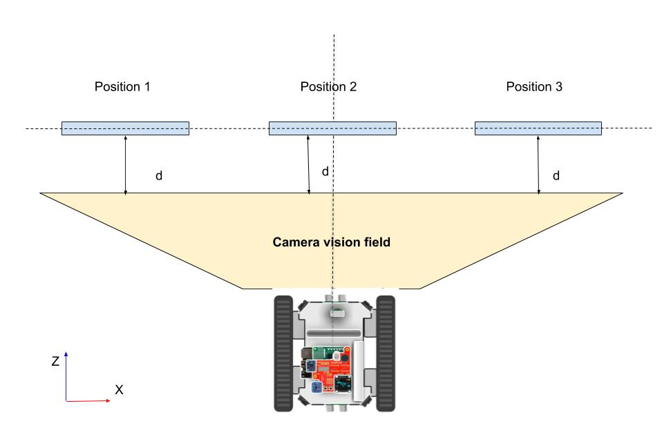
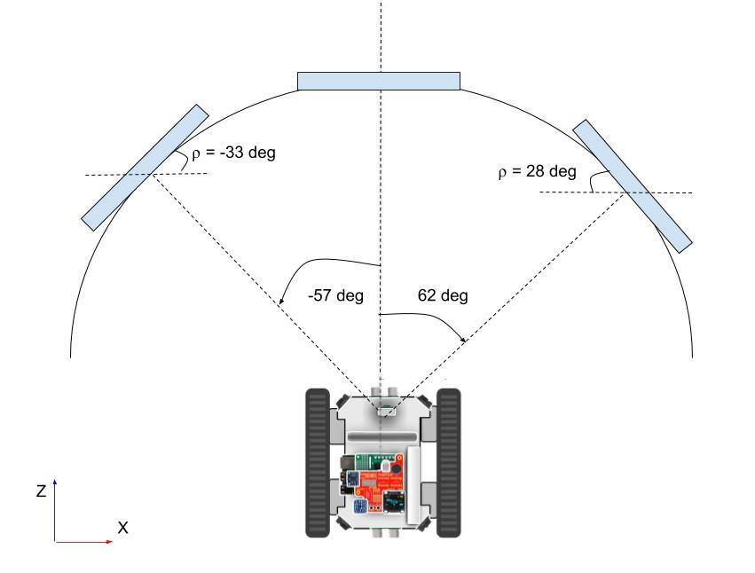
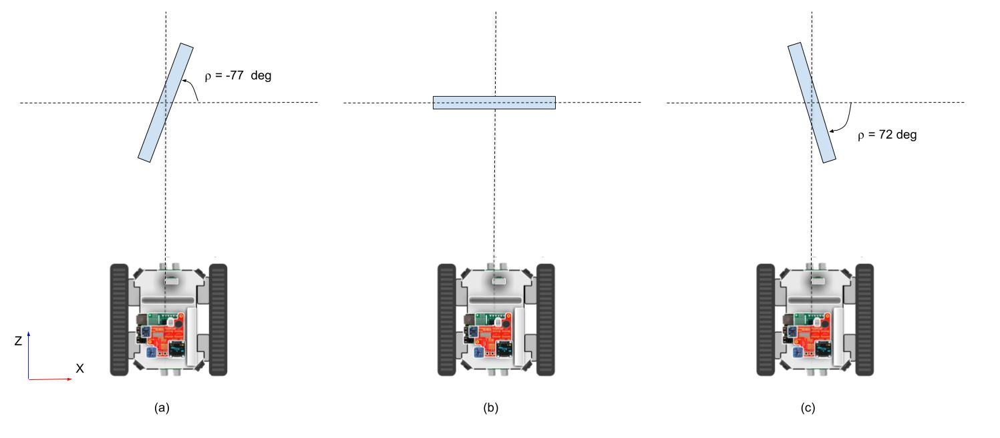
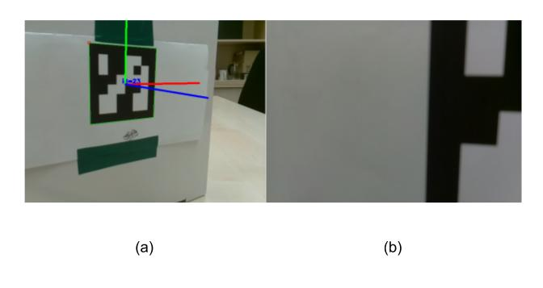

Challenges and issues
============================

In this chapter we will describe open challenges and unresolved issues that should be addresed or taken into account in further versions of the described rover-app.
We describe the following issues and challenges: extrinsic parameters estimation, limited camera vision field,  marker maximum detectable rotation, error measurements in the current distance sensing system, and migration from Raspbian to AGL. 

Estimation of extrinsic parameters
-------------------
We should always remember the pinhole model. 
The _world frame_ or plane is projected onto the _image frame_ or plane. 
Figure \ref{img:visionfield} presents a marker in three diferrent positions. 
Rotation and translation vectors  are the same for each position, because from the perspective of the camera they belong to the same world plane, thus rotation and translation vectors in all the cases are the same. 

Camera vision field
-------------------
The PiCamera mounted on the Rover has a limited vision field. 
As observed in figure \ref{img:circularshape},  the PiCamera can only sense from $-33$ degrees up to $28$ degrees for a radius of 50cm, in other words the vision field  has a $-33$  degree limit on the left side and a $28$ degree limit on the right side. 
We could consider the vision field as a trapezoid as in figure \ref{img:visionfield}.  
Thus, the closer the marker to the camera the smaller the vision field due to pinhole model and image projections. 
In addition, the limits are not the same because the PiCamera is not perfectly aligned with Rover axis. 

Maximum detectable rotations
------------------
There is a maximun $\rho$ angle in clockwise and counterclockwise directions that can be detected.
In figure \ref{img:maximumrrotations} the position and angle in which the marker can still be detectable is shown. 
For counterclockwise rotations the maximum $\rho$ angle is $-77$ degrees and for clockwise rotations is $72$ degrees. 

Problems measuring distance traveled
-----------------------
There is no sensor mounted on the Rover that accurately  measures  the distance traveled, such as GPS or encoders. 
We are using an ultrasonic sensor to measure the distance to the marker, however this approach only works when the rover Leader is within a 40cm radius and its orientation is not greater than 30 degrees given the way that sensors works. For angles greater than 30 degrees the bounced waved is not detectable. 
Due to the previous explained reasons and the fact that the estimated distance to the marker is known, the use of a sensor to measure distance travelled is needed, and also it will broad the range of possible applications.  

In addition, sometimes the Follower is not able to detect the marker anymore since it is very close to it due to the fact that our system does not measure accurately the distance travelled. An example is shown in  \ref{img:results}. 
It is observed that at the final position $d=3cm$, the Follower lost track of the marker. 

Switching to Raspbian to AGL
--------------
The rover-app described in this document runs on top of the Raspbian operation system.
In further improvements the application should run on AGL. 
However, the current version of the Eclipse Kuksa software development kit (SDK) is not compatible with `OpenCV 3.4.1`, thus this issue should be addressed first. 

